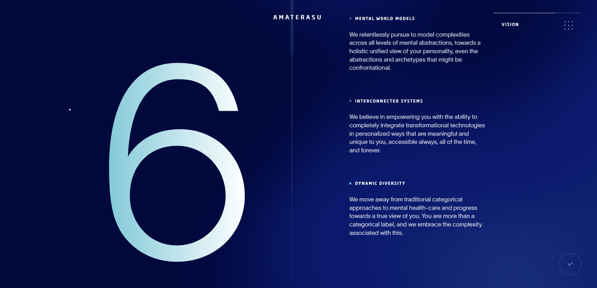
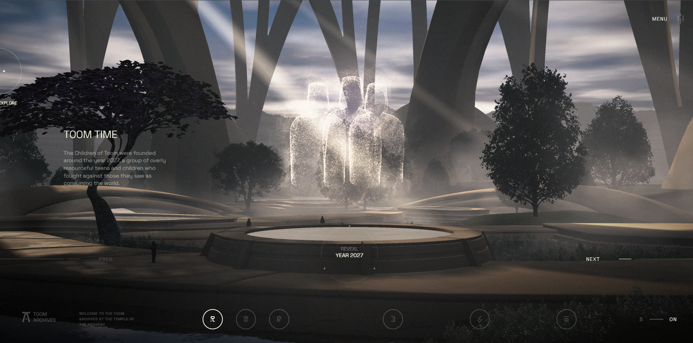

Scroll animation site: https://project-management-99.aura.build/

Tech site with black moving hero
https://pat-budi-perkasa.aura.build/

https://fluxer.aura.build/
**What I like**: Clean structured site with nice pacing
**Use for**: Landing pages, SaaS sites

https://creative-studio-91.aura.build/
**What I like**: dark hero with moving elements
**Use for**: Landing pages, SaaS sites
   

https://futuristic-particle-11.aura.build/
**What I like**: interactive particle cloud
**Use for**: Landing pages, SaaS sites

https://life-design-coaching-95.aura.build/           
**What I like**: half moon with particles in hero, super sick, also nice text below, site is broken below that
**Use for**: Landing pages, SaaS sites

https://world-championship.aura.build/           
**What I like**: Dark tech site with orange elements
**Use for**: Landing pages, SaaS sites

https://frontend-engineer-template.aura.build/
**What I like**: clean text highlighting in the hero, nice spacing and dark vibe
**Use for**: Landing pages, SaaS sites

https://frontend-engineer-template.aura.build/
**What I like**: Clean structured site with nice pacing
**Use for**: Landing pages, SaaS sites

https://house36-accountant.aura.build/           
**What I like**: Clean dark company site were everything is placed on like a card with a dark background
**Use for**: Landing pages, SaaS sites

https://ai-predictive.aura.build/           
**What I like**: techy dark site with particles and moving elements
**Use for**: Landing pages, SaaS sites

https://janissne.com/

futuristic portfolio website

https://amaterasu.ai/

insane scroll animation site, futuristic, AI theme

https://www.igloo.inc/
**What I like**: Extremely cute, character-driven 3D narrative.
**Technique**: "On-Rails" Scrollytelling. Heavily optimized 3D scenes (likely baked animations or highly efficient glTF) triggered by scroll progress. Different from Immersive Garden's "abstract/atmospheric" style; this is "narrative/character" style.

https://www.aten7.com/intro 

immersive 3d site 